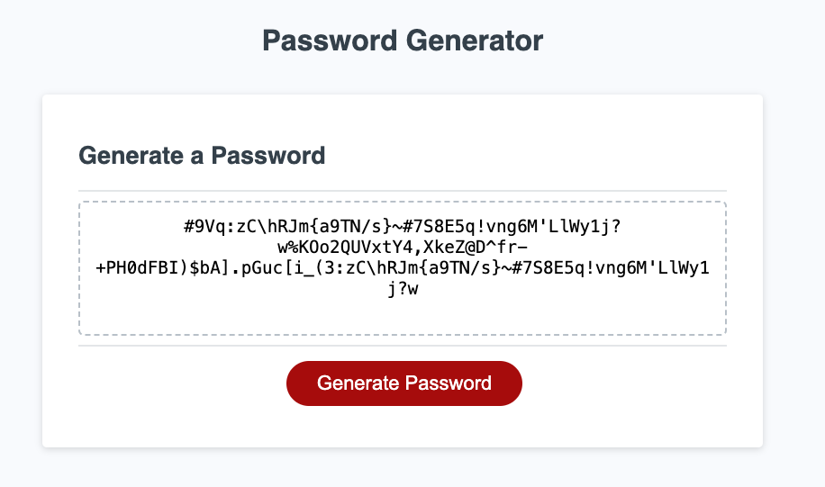

# Password-Generator

## About this project

This is a intermideiate Javascript practice, making password generator app for a bootcamp. In this practice, you will see the intermideate technique of Javascript, using xxx. The guidance is provided for the roadmap below.

### Built With

- ![HTML]
- ![CSS]
- ![JAVASCRIPT]

## Roadmap

- [x] Generate a password when the button is clicked.
- [x] Present a series of prompts for password criteria
  - [x] Length of password: ask a user how long a password the user wants to be
  - [x] At least 8 characters but no more than 128: state and set the condition to the user
  - [x] Character types: confirm a user for the restriction below
    - [x] Lowercase
    - [x] Uppercase
    - [x] Numeric
    - [x] Special characters ($@%&\*, etc)
- [] Code should validate for each input and at least one character type should be selected above
- [x] Once prompts are answered then the password should be generated and displayed in an alert or written to the page

These roadmap result will look like thepicture below

## Important note

This is a Javascript practice for the bootcamp project.

### Preview

#### This is the Github page

[password-generator](https://sebecjeanluc.github.io/password-generator/)

### Credits

This is a practice for the bootcamp. The starter file is protected by the bootcamp.

### Third-party service

N/A

### License

Distributed under the MIT License. See `LICENSE.txt` for more information.

## Contact

Tak Kawamura - [@\_takuyakawamura](https://twitter.com/_takuyakawamura) - tkawamura11@gmail.com

<!-- MARKDOWN LINKS & IMAGES -->
<!-- https://www.markdownguide.org/basic-syntax/#reference-style-links -->

[HTML]: https://img.shields.io/badge/HTML-orange
[CSS]: https://img.shields.io/badge/CSS-blue
[JAVASCRIPT]: https://img.shields.io/badge/Javascript-yellow
